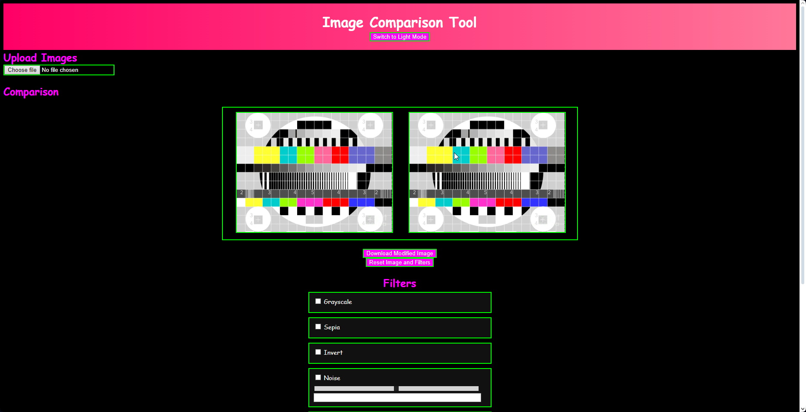

# VHS Video and Image Creator

A tool to create VHS-style effects on videos and images.

---

## Table of Contents

- [Introduction](#introduction)
- [Features](#features)
- [Installation](#installation)
- [Usage](#usage)
- [Contributing](#contributing)
- [License](#license)

---

## Introduction

Create unique images from special filters and effects

---

## Features

- use special image filters/effects
- download your image
- use any image you want

---

## Installation

To use this template, follow these steps:

1. Clone the repository: `git clone https://github.com/<username>/<repo>`
2. Navigate to the project directory: `cd <repo>`
3. Install the dependencies: `install command`

---

## Contributing

To contribute to this project, follow these steps:

1. Fork the repository.
2. Create a new branch: `git checkout -b feature-branch`
3. Make your changes and commit them: `git commit -m 'Add new feature'`
4. Push to the branch: `git push origin feature-branch`
5. Submit a pull request.

---

## License

Distributed under the MIT License. See `LICENSE` for more information.

## Contact

@devvyyxyz - [@devvyyxyz](https://twitter.com/devvyyxyz) - devvyydev@protonmail.com

Project Link: [https://github.com/devvyyxyz/100-python-games](https://github.com/devvyyxyz/VHS-video-and-image-creator)

## Acknowledgements

- [devvyyxyz's repository-template](https://github.com/devvyyxyz/repository-template)
- [GitHub Pages](https://pages.github.com/)